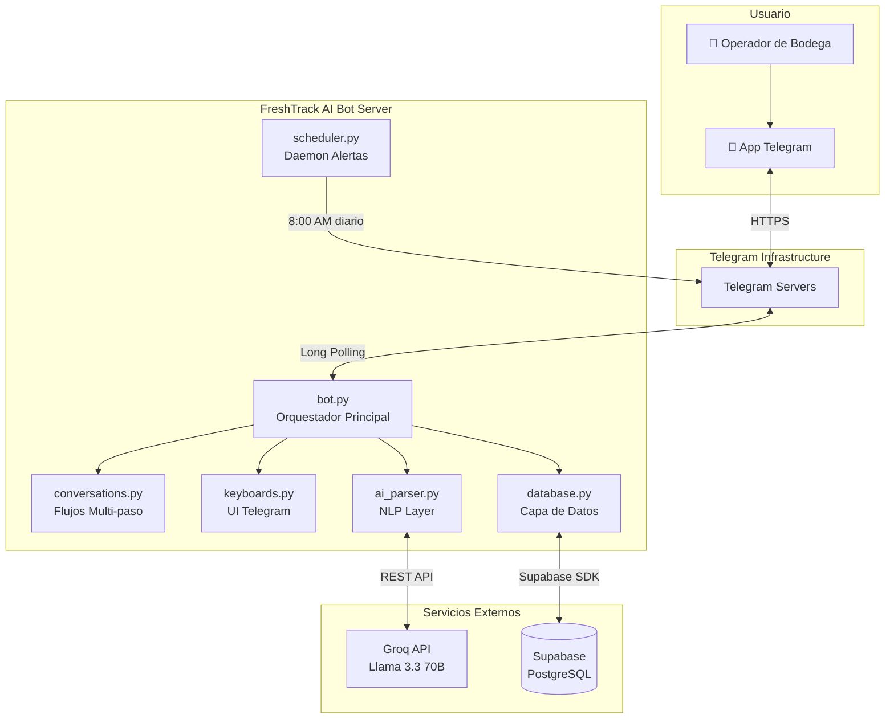
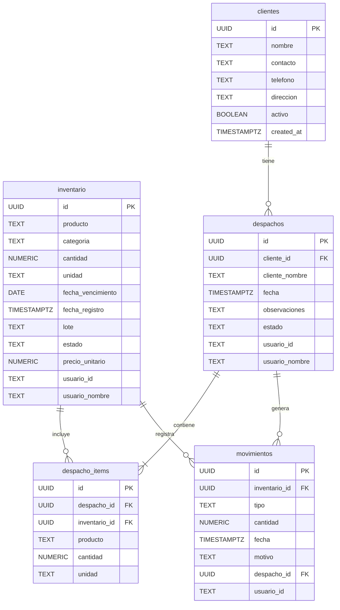
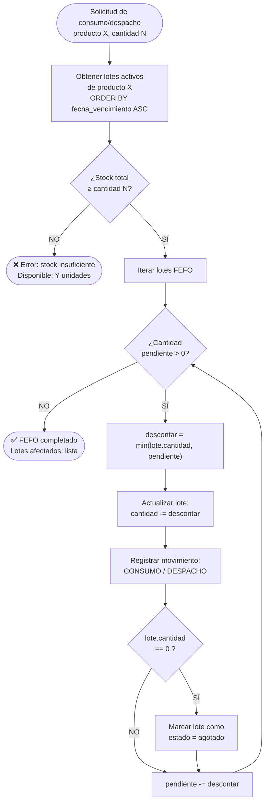
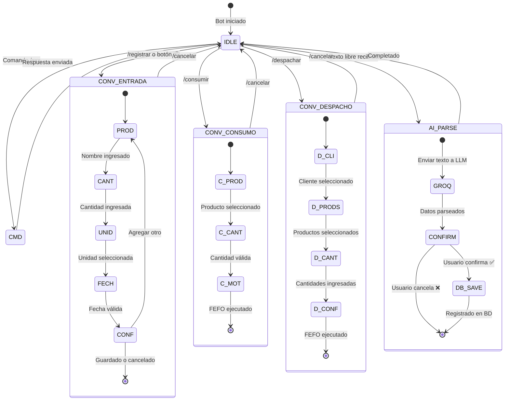
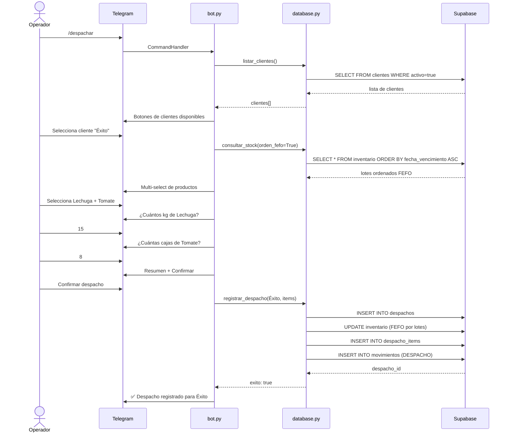

# FreshTrack AI — Diagramas Técnicos

> Todos los diagramas están validados y renderizados con Mermaid Chart.  
> Haz click en el enlace **"Ver en Mermaid Live"** para ver interactivo o editar.

---

## Diagrama 1 — Arquitectura General del Sistema

**Tipo:** Flowchart  
**Descripción:** Vista de componentes del sistema mostrando las capas del bot, los servicios externos (Groq, Supabase) y la conexión con Telegram.

[Ver en Mermaid Live](https://mermaid.ai/live/edit?utm_source=claude_widget&utm_medium=embed&utm_campaign=claude#pako:eNp9kt9u0zAUxl/Fym5AolNYy7ZWCCl_lq5at2ZLyk2C0GnitmGundkOoiI8BOIBuOEFeDMeATtORzrU-So-5-fvnPOdfLUylmNrZK04lGsUuylF6ohqYQJzUQEvmInqM0_-_Pz-C81KzCFnHOUYuUphBR_-MfFYQT9-I6csUYwJVlKbNo1pntInNVJrB6EJXXIQkleZrDhOra5mlDxiEeafMRfPagYci3XMIbtHzkT1KNtXXVF3FicLJo_LbZrSGX-osJDNVCEvaFaUQDpTebOb90nGqK4MsmBUmHcBqT4xga4rIoteCYJ13ly5yT3eLhjwvKXnk6eW6ONMEig-lsAF5oa7mYZoClvMO5TvJjlIWIDABvKgBL0BHyQTHTDyLhORrXFekZ2eD3jDKHJUQMLzzmmfiqxQM118kZhTJrqeje9mt8mYswfkhBMlPCWwAdQ_7qMz2-324CYvoqpsulVYyIRccRzdTl_-X3yOer13asXmFo_RW3WvL-M4jGq9-V08MokpoysUMkIKuqr1Ek1efTQ6elH7kSt3_-5M9u9-m1e-6Xt9PrJt5FyjvNA_f6cF9Sc1HdxdRLGev27sMDnfNbnd0Cjyr2plw6PDcktwU3JZEDI6Onk9PA36rzJGGB8dLZfLLqYKGWronZy59gFKlTTUwHOCN4co3WLLBcHw3D7ERTs123Y9f3CIUh61YoNBv3_awaxvfwECNFP4)

---

## Diagrama 2 — Esquema Entidad-Relación (Base de Datos)

**Tipo:** ER Diagram  
**Descripción:** Modelo relacional de las 5 tablas de Supabase: inventario, clientes, despachos, despacho_items y movimientos.

[Ver en Mermaid Live](https://mermaid.ai/live/edit?utm_source=claude_widget&utm_medium=embed&utm_campaign=claude#pako:eNqlVF1rgzAU_SvB9_2BvnWrg7L1g83CGIKkya29oInEKAzb_76ktdVGWx3Lk5ybY865JzeVxyQHb-KBmiGNFU1DQcxCUYLQVKEk1Rmxa7OZzwhysn5rsMD_CkimJC-Ylg7MqIZYKqQNvtws_I_5iykJjZxyh1GIW3A2DXyyA7ankRHEMEUjq33MfOF_BtPFOviutymIMdfKlZJIDQ4EuaZcdqVlChjKyEg5NcBVmBcWjZDfKQiZblV91jEU5w-WWOGQj-pm-w9NL6XJo9tiDQnspHBhjsaEcSEa_Hm1evenS2J-guWdFjIFJjIeUe3o55BnlO3loIETVrs1PSKvrrlLrWPSTdLhyW0OqqTWE-QDSf4jqIvRCDWk49w2lFu7Z8J1kHq70R2cPwzIVXQqy3oyxikeEKUxGydoILJU3t60h93qzaw7P4fD05OsWvdxQkJPmyKEnntV7d5D5UZqCXaY2pzWc-cc0CKhYEnx84DTjsES6qeI9ivrIcRGkt3uHX8BBrqq9Q==)

---

## Diagrama 3 — Algoritmo FEFO (First Expired, First Out)

**Tipo:** Flowchart  
**Descripción:** Lógica paso a paso de cómo el sistema descuenta inventario de múltiples lotes respetando el orden de vencimiento.

[Ver en Mermaid Live](https://mermaid.ai/live/edit?utm_source=claude_widget&utm_medium=embed&utm_campaign=claude#pako:eNqNU9lu00AU_ZUr9yWRUhqpAYGlFBkvCcoyke1KrWyrcsfjdsTEE9mTVJD0kQck-AN45DuQ4E_6Jcx4yQJEwk_j8T3LPfd6rWGeEE3XUsYf8H2cC_CtMAP5eL7h-q3A44xiKpYJJAQwz4rlnJ8lpFjE-J6HYbbIebLEgsNVB3CcCZrECUyjNpyeXoBj--YwzCrC8iVAt4JkJAfGBSkgxoKueCF5JPuOSr4j17JdeHMNKZG-blYkw3ROSSY_G54ZHZCWWubQNkc3no_M0frnD09w_A4EFzGTZE-fvu-Ze_1YYfcQimEzRRuwXRe5reDp22ew85znOhQlE5WNpzIIaYBIQosWC57RW0Z0uIZlpohJEbX_Tez9-rKBMUKzxrU6B28FyeMmCMd2UFT2MUa-LRswa7sqYpIlpTBcQLcxr8q2ri00tf-4LjVNY2w2muachJq0KacopHAf5jRrKflnTTYd2Gq1Qy3aAUtnlzPL8O3AwGIZM_qh9q5Lh9tsT_uwFajhFapubRC45I4WQjU-56t6oorCRFPvcoLgDCzbmxnmEEVNR4MSbAyQb1hofWBYAvt96EKTSl20S2BiuKNgEue4ditXeK7WlhQiTrjMIL7j6hT9jVfBTu0rv_qiiEofuyt1CnbDOeh9O8omfjUiuVdfP5ajVjYWjChlaWZc_Qty09VFoQOTEcVqmypsId4zUv2QkFLG9JOeaTjPux3MmVzRkzRN9wuV1P_UlbteFzq93vn5iyOF-_tclzuvXnaP8TYhHinVHn8Dd4RwdA==)

---

## Diagrama 4 — Máquina de Estados de Conversaciones Telegram

**Tipo:** State Diagram  
**Descripción:** Todos los estados posibles del bot: flujo de entrada, consumo y despacho como máquinas de estado finitas.

[Ver en Mermaid Live](https://mermaid.ai/live/edit?utm_source=claude_widget&utm_medium=embed&utm_campaign=claude#pako:eNqVlE-O0zAUxq_y1BUgVZWQ2HSBlCZpJ9K0KWk7GwZFbmKKUWIXx6kqjWbJjh1bRogNF-AIc5M5AUfg2fnrUQZBF13k_d6zv8-ffTNKREpH01GhiKIeIwdJ8vHp5TUH_L198Q7G49cQeJc-TGEmFDDOEkZScc0rxJQ044arq9hfbSPHc5CdSHpghZJEgoC9UPe_OPz-_vXnUBf-bXbLUHclghdlzuQQ5vmbteNeGC6lxZEkH8hj0AnitRNt9G639KwEZGwvKUiasD3Tu7bHLj0EXZETngqYnM_nRpaxw9Z0U1X6vqyjUA8ItCeiK5vPZr6z2mJ9JXK9CcYPkhYk7ZEG0ORuFZitEK5YStKWJR1rEM3OffcC2R03ZEEzmuDy3IINUzs3R3hO0Sw43f_IsGlouuF0g9Y2hUVJJE4XeHgJ4QnN7G03cG2Ag-MO-qSVFHCUIi0TVeO3A4425z3gqBs_4WldqJja13W9Ut8Dq6W1142X4bbvb-1EH9ZEZ4BrgiiAfqRJqbQTc38ePq2pDeeAKC92L4MBTdX3itDqNnrdjFGOQ4clNVw91bahsJoKa53GCC-uA9E4QYsuDXaLHQivunACmnv9N0faWzhgxiIK3-A8n58YJobAQopP4KyDjjREk90gWurViZZ3JLKgtrQGMdpm8ca50ld_V2B8GUZX8PdM5gQevn0e7qnEtXwVdXi4-9Kzoh7b4VFnAeUw8x55YL0avedzUo-X8EyxnIpSwauc8ee9ruZm_F9Xm71_bmsPqNeBz-Axo6rNm34ce-UIA1BSPF_UjEeXktHtH6ohzFY=)

---

## Diagrama 5 — Secuencia: Despacho a Cliente con FEFO

**Tipo:** Sequence Diagram  
**Descripción:** Flujo completo de un despacho: selección de cliente, multi-selección de productos, ingreso de cantidades, confirmación y ejecución FEFO en base de datos.

[Ver en Mermaid Live](https://mermaid.ai/live/edit?utm_source=claude_widget&utm_medium=embed&utm_campaign=claude#pako:eNqNVM1q20AQfpVBvTiN45JDIBiSYEtyEkiiYKmUUhezXq2draVdRbsyKSHHHvoOvfTYcx6gUL9Jn6Sz-rFVySk12ALPNzPffPONHi0qQ2b1LcXuMyYoczhZpCSeCMAPoVqm4CVAFP6ylIQyLSIJSTWnPCFCQ3Bu4gGL2DazHh9KbQAzqXvJ53bYGZpoSDSZEcV2Qvwc4mdJDpmIAuElB6enwXkf3oRMJYTekZJccI4B7NoHW8YxEeEFfiNWRjGAYWfYh4grTdIpjTgTmqnOXgFwhhj3Me67V64dwGjsXUMFgncX7tg1yvCVPNFpxookf3hQrwoh26RsqlasqsCHj3VGZpKJ9evnAO6z9Y8KdDaxYN9oJwU2_7tkPqeX9OE6Y0qnpIK1BLIjTpdYfP31gWs5sZoyucg4lOBMb8ee4zdlolKoLDJKKS3psiPTkInpnM3lSYDzv6Da60I3LlbImKRclsqxvNdJISB4Y8cdw_A9zBnub4pYymMzo4SBb7eklWYDeX-s0RY2SWWYoWfRTlwlUvBZVGm11fgaZ-EHCu1KtVnTNmkfJfr97Qu6Rsx5GqOdrIbQ9h2jy5l8QBb1zJbgvqlOuRQErnCwbEGweCBjolm33Ma2yUvLsAc3AXQSvMCq0d4uv9jZ-rsw9JcLQ6rsd1Zx33CaWIdH1Z-7KuCFUfKJ5JMVVHfVOG6XGDOVxUwUNl0_i_poO424iUN5uPJlDbybkTFgjg9l05opW3Dj_HRaVeoUHu8C1yxWXej1ek2DXt747jjAR-BtCKgG5mr9vOCUwMgdeVBfQQP39tYZBG7d5Z2VeajCq__Tepoz_QcwlqvyJhR0HNe_HdgX3l7zNh639cKn1mU8skKVGqi79e9T2xXmDpwSDK8unY3UuBZ8NRMo3yUTcXiExitd14Xj0kSFg9oHVK6ScmOUkEUbRtbTH__RHzg=)

---

## Resumen de Diagramas

| # | Título | Tipo | Estado |
|---|--------|------|--------|
| 1 | Arquitectura General | Flowchart | ✅ Válido |
| 2 | Esquema ER — Base de Datos | ER Diagram | ✅ Válido |
| 3 | Algoritmo FEFO | Flowchart | ✅ Válido |
| 4 | Máquina de Estados — Conversaciones | State Diagram | ✅ Válido |
| 5 | Secuencia — Despacho con FEFO | Sequence Diagram | ✅ Válido |
